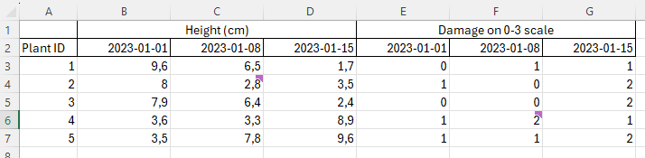
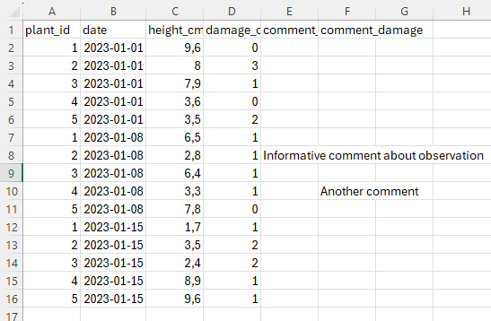

```{r setup, include=FALSE}
knitr::opts_chunk$set(echo = TRUE, warning = F, message = F, error = F)
```

```{r, echo = F}
library(ggplot2)
library(dplyr)
library(cowplot)
library(extrafont)
library(tidyverse)
library(magick)

theme_set(
  theme_bw() + 
    theme(plot.background = element_rect(fill = "#eaebff", color = "#eaebff"),
          legend.box.background = element_rect(color = "black"))
)
```

## 

::: {style="position:absolute;width:80%;height:500px;border: 0px double;padding: 150px 10px; left:10%; top:20px;"}
::: {style="position:absolute;width:500px"}


::: {style="font-size:0.25em;position:absolute;right:0px;"}
Illustration: Amrei Binzer-Panchal
:::
:::

::: {style="position:absolute;text-align:left; font-size: 1.5em;padding:50px;left:500px;width:50%;"}
<br>

::: {style="font-size:0.5em"}
Basic Biostatistics and Bioinformatics
:::

Project organisation in R and RStudio

::: {style="font-size:0.5em"}
Swedish University of Agricultural Sciences, Alnarp
:::

::: {style="font-size:0.3em"}
<br>17 June 2024
:::
:::
:::

## Basic Biostatistics and Bioinformatics

A seminar series on the fundamentals

Organised by *SLUBI* and *Statistics at SLU*

Presentation of background and a practical exercise

<br> Topics

-   17 June. Projects in R
-   1 July. Shiny

<br> Topic suggestions are welcome

## 

**SLUBI**

-   SLU bioinformatics center
-   Weekly online drop-in (Wednesdays at 13.00)
-   [slubi\@slu.se](mailto:slubi@slu.se){.email}, <https://www.slubi.se>
-   Alnarp: Lizel Potgieter (Dept. of Plant Breeding)

<br>

**Statistics at SLU**

-   SLU statistics center
-   Free consultations for all SLU staff
-   [statistics\@slu.se](mailto:statistics@slu.se){.email}
-   Alnarp: Jan-Eric Englund and Adam Flöhr (Dept. of Biosystems and Technology)

## Today's content

Projects in RStudio

Organisation of folders, scripts, output files

Code style

Some specific packages

## Projects in RStudio

Created in *File > New Project... > New directory*

Links a basic folder to RStudio

Sets the folder as the working directory

- No need for `setwd("C:/folder/folder/folder")`

Easy to switch between projects

Easy to share with others

## Project options

*Tools > Project Options...*

I recommend to not restore RData at startup

New session will start with an empty environment

Easier to keep track of what objects are currently stored

## Organisation of folders

Organise files in sub-folders

Suggested folders ([source](https://www.stat.ubc.ca/~jenny/STAT545A/block19_codeFormattingOrganization.html)) could be

- `raw-data`
- `data`
- `code`
- `figs`
- `results`
- `prose`

## Raw and processed data

`raw-data` 

- Files created by others
- Requiring a process-step to be easier to use

<br>

`data`

- *Tidier* format
- General format if possible (`.csv`)

## 

**Raw data**



**Cleaner data**



## Scripts

The code is collected in scripts

Multiple shorter scripts is usually clearer than few long ones

<br>

Divide scripts by purpose

- `process-raw-data.R`
- `import.R`
- `exploratory-graphs.R`
- `formal-tests-and-models.R`
- `presentable-graphs.R`

## Storing output

Given data and scripts, it should always be possible to reproduce any results 

Still useful to export objects

- If certain results are sent to others
- If certain calculations are time consuming

R objects can be saved as `.RDS` files (or `.RData` files)

```{r, echo = F, eval=F}
saveRDS(model_object, file = "output/model_object.RDS")
```

## Code style

Spaces after commas and around `=`

Clear names with words split by underscore `_` 

<br>

[The tidyverse style guide](https://style.tidyverse.org/)

The [styler](https://styler.r-lib.org/) package can be to enforce the style guide

## Script sections

Include a header explaining the goal of the script

Possibly also ongoing changes and dates

Load packages at the top

<br>

Split into sections with headers for each section

Section splits can be be created with `####` or `----`

Comment so that others can understand

RMarkdown allows for further mixing text and code

## Packages for reproducibility and organisation

renv

- Problem: updates to R or packages can break the code
- renv keeps track of installed packages
- A project is run with a specific set of installed packages

<br>

targets

- Problem: changes to one part of a project can affect another part
- targets keeps track of the sections of a project
- Notes how changes in one part might change another part

## renv

Any R session is connected to a *library* - a folder where packages are installed

The path can be shown with `.libPaths()`

Packages are loaded by looking in the library `library(package)`

<br>

We mostly work with the general library

New packages or updates are used by all projects

<br>

The renv package creates a project-specific library

## renv use

**Initialisation**

Select *Use renv* when creating a new project

Or run `library(renv)` and `init()` in a current project

<br>

**Install packages**

Packages can be installed in the standard way `install.packages(name)`

Saved in the renv folder in the project

<br>

## Storing and restoring

**Creating a snapshot**

After installation running `snapshot()` *saves* the current library

Listed in the `renv.lock` file

<br>

**Restoring a snapshot**

The library can be restored with `restore()`

Another user (or future you) can recreate the exact same environment

## targets

A data analysis consists of some ingoing information (data) and a series of analysis steps

Some common steps

- import data
- create exploratory graphs
- estimate models and perform tests
- create presentable graphs

A step will depend on other steps

- graphs and models depend on import
- statistical graphs depend on model estimation

If an earlier step changes, later steps must be re-run

The [targets](https://books.ropensci.org/targets/) package keeps track of step dependencies

Prevents missed changes as well as unnecessary steps

## targets use

The basic use is to wrap analysis steps in functions

Example from package website

```{r, eval=FALSE}
get_data <- function(file) {
  read_csv(file)
}

fit_model <- function(data) {
  lm(y ~ x, data) %>%
    coefficients()
}

plot_model <- function(model, data) {
  ggplot(data) +
    geom_point(aes(x = x, y = y)) +
    geom_abline(intercept = model[1], slope = model[2])
}
```

## Target script

The relation between these functions is specified in a target script `_targets.r`

```{r, eval=FALSE}
library(targets)
source("functions.R")
tar_option_set(packages = c("readr", "dplyr", "ggplot2"))
list(
  tar_target(file, "data.csv", format = "file"),
  tar_target(data, get_data(file)),
  tar_target(model, fit_model(data)),
  tar_target(plot, plot_model(model, data))
)
```

1. Creates the `file` - a name of an object
2. Get data using `get_data()`. The input is file and the output is data
3. Apply `fit_model()`. The input is data and the output is model
4. Apply `plot_model()`. The input is model and data, and the output is plot

## Running sections

This *pipeline* can be run with `tar_make()`

The first time this will run all steps

`tar_visnetwork()` shows a graph of the steps

<br>

If there are any changes the effects can be seen in `tar_visnetwork()` or `tar_outdated()`

`tar_make()` will re-run the pipeline, but only the relevant steps

## The End

<br><br>

Next session July 1

- Shiny. The R system to create apps and interactive webpages

<br>